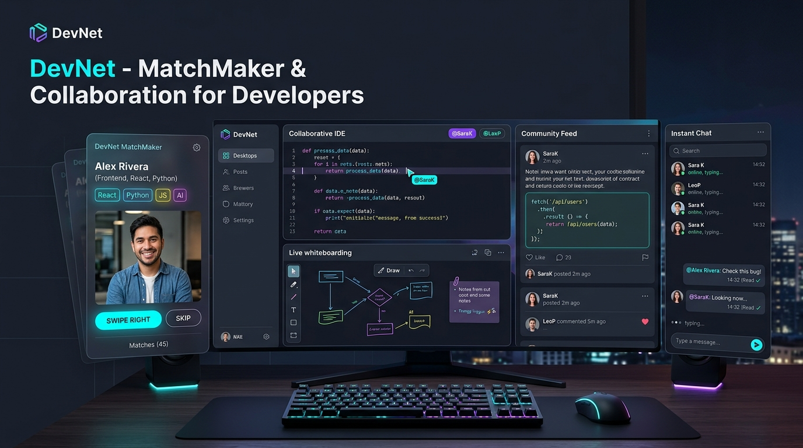
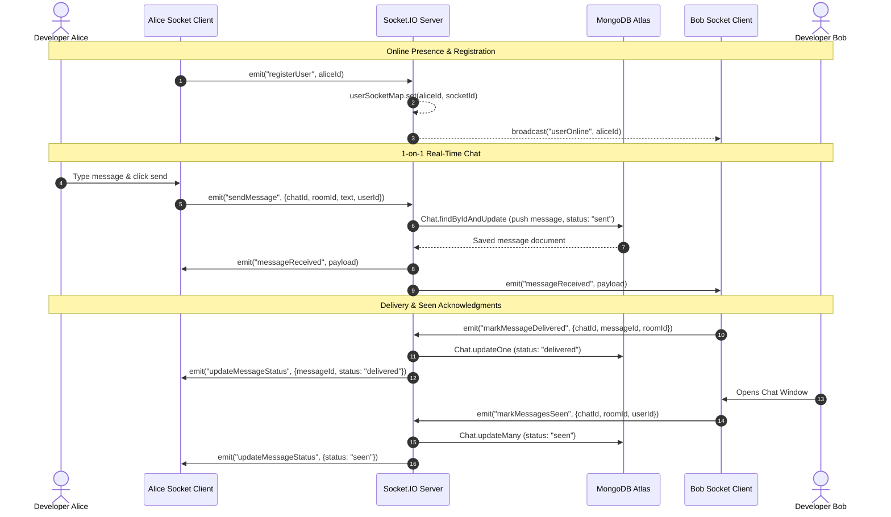
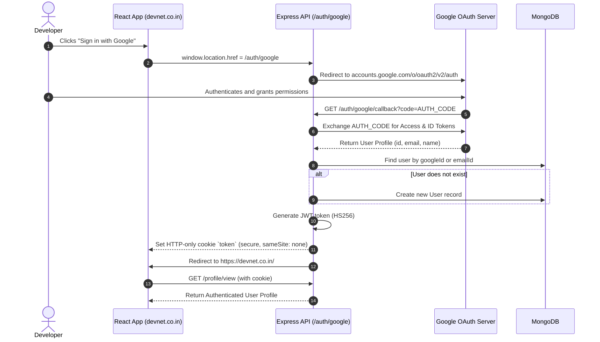

# 🚀 DevNet: Intelligent Developer MatchMaker & Real-Time Collaboration Ecosystem

<div align="center">



[](https://devnet.co.in)
[](https://vercel.com)
[](https://render.com)
[](https://react.dev/)
[](https://tailwindcss.com/)
[](https://socket.io/)
[](https://www.mongodb.com/)

**DevNet** is a modern, full-stack, real-time social networking and collaborative development platform designed exclusively for software engineers, designers, and tech creators. It combines the rapid discovery of swiping-based matchmaking with professional collaboration utilities: live multiplayer whiteboarding, instant chat with read receipts, tech Q&A community forums, and portfolio management.

[Explore Live Demo](https://devnet.co.in) • [Report Bug](https://github.com/Mr-Elegant/DevNet/issues) • [Request Feature](https://github.com/Mr-Elegant/DevNet/issues)

</div>

---

## 📑 Table of Contents
1. [Executive Summary & Core Philosophy](#1-executive-summary--core-philosophy)
2. [Feature Matrix ("Everything This App Does")](#2-feature-matrix-everything-this-app-does)
3. [High-Level Design (HLD)](#3-high-level-design-hld)
   * [System Context Architecture](#system-context-architecture)
   * [Multi-Platform Deployment Topology](#multi-platform-deployment-topology)
   * [Real-Time WebSocket Pipeline](#real-time-websocket-pipeline)
   * [OAuth 2.0 & Authentication Flow](#oauth-20--authentication-flow)
4. [Low-Level Design (LLD)](#4-low-level-design-lld)
   * [Database Schemas & Data Modeling](#database-schemas--data-modeling)
   * [REST API Catalog](#rest-api-catalog)
   * [WebSocket Event Contract Specification](#websocket-event-contract-specification)
   * [Frontend State Machine (Redux Toolkit)](#frontend-state-machine-redux-toolkit)
5. [Step-by-Step User Manual ("How To Use Every Feature")](#5-step-by-step-user-manual-how-to-use-every-feature)
6. [Local Development & Setup Guide](#6-local-development--setup-guide)
7. [Production Deployment Guide](#7-production-deployment-guide)

---

## 1. Executive Summary & Core Philosophy

Finding engineering co-founders, project collaborators, code mentors, or tech peers has historically been fragmented across LinkedIn, Discord, and GitHub. DevNet resolves this by providing an all-in-one developer ecosystem that balances **instant engagement** with **deep technical productivity**:

* **Discovery**: Tinder-style interactive swiping algorithm tailored to programming languages, skills, and developer interests.
* **Collaboration**: Instant transition from discovery to a 1-on-1 chat room or a live shared whiteboard canvas.
* **Knowledge Sharing**: Global technical feed with Markdown formatting, syntax-highlighted code blocks, threaded discussions, and Stack Overflow-style accepted answers.
* **Monetization**: Tiered memberships (Silver & Gold) integrated with Razorpay payment gateways and automated verified badges.
* **Resilience**: Zero-cost cloud footprint utilizing Vercel, Render, Cloudflare, MongoDB Atlas, Cloudinary, and an automated keep-alive heartbeat service.

---

## 2. Feature Matrix ("Everything This App Does")

### 🎴 1. Developer MatchMaker (Tinder-Style Discovery)
* **Interactive Swiping Engine:** Built with `react-tinder-card` and `framer-motion` for fluid 60 FPS gesture-driven swiping.
* **Smart Filtering:** Explore profiles based on technical skills (React, Node.js, Python, AWS, etc.), developer role, and bio.
* **Connection Logic:** Swiping right sends an `interested` request; swiping left triggers an `ignored` state.

### 💬 2. Real-Time Chat & Messaging Hub
* **Instant Delivery:** Sub-millisecond bidirectional communication via Socket.IO.
* **Read Receipts & Delivery Indicators:**
  * `sent` (Single checkmark) &rarr; Message saved to database.
  * `delivered` (Double checkmark) &rarr; Recipient client received packet.
  * `seen` (Blue checkmark) &rarr; Recipient opened the conversation room.
* **Rich Media Attachments:** In-memory upload stream to Cloudinary supporting images, documents, and code files.
* **Presence & Activity:** Live online/offline green status indicators and debounced "User is typing..." indicators.
* **Message Management:** Secure, atomic message deletion with MongoDB `$pull` operators preventing unauthorized deletes.

### 🎨 3. Collaborative Multiplayer Whiteboard
* **Powered by `tldraw`:** Unlimited infinite canvas supporting freehand drawing, geometric shapes, sticky notes, arrows, and asset embedding.
* **Real-Time Room Synchronization:** Changes broadcast across room peers using dedicated Socket.IO whiteboard rooms (`whiteboard_${roomId}`).
* **Instant Chat Invitations:** Send a whiteboard invite link directly in a 1-on-1 chat; the recipient can accept or reject in real time.

### 🌐 4. Global Community Feed & Technical Q&A
* **Rich Developer Posts:** Post technical questions, project updates, or architectural thoughts.
* **Syntax-Highlighted Code:** Full code-snippet support formatted for easy technical readability.
* **Interactive Discussions:** Threaded comment hierarchy with reply chains.
* **Accepted Answer Checkmark:** Post authors can mark the most helpful reply as "Accepted" (highlighted with a green checkmark).
* **Social Reactions:** Real-time post like counts and engagement counters.

### 👤 5. Developer Portfolio & GitHub Showcase
* **Portfolio Showcase:** Add personal projects with titles, summaries, live preview URLs, and screenshots.
* **GitHub Integration:** Display GitHub profile stats, primary languages, and repositories directly on your user card.
* **Custom Avatar & Bio:** Cloudinary-backed profile picture uploads with cropping and skill badge tags.

### 💎 6. Monetization & Premium Subscriptions
* **Tiered Memberships:**
  * **Silver Member:** Custom profile themes, elevated feed visibility.
  * **Gold Member:** Unlimited matchmaking swipes, verified gold badge, premium chat perks.
* **Razorpay Gateway:** Secure order generation, client-side checkout modal, and cryptographically verified HMAC SHA-256 webhooks.

### ⚡ 7. 24/7 Resilience & Background Services
* **Automated Keep-Alive Heartbeat:** Built-in Node scheduler that self-pings the public `/health` endpoint every 12 minutes, preventing Render free-tier instances from idling.
* **Daily 9:00 AM IST Email Digest:** Automated `node-cron` background worker that queries pending connection requests and dispatches transactional summary emails via Resend (`notifications@devnet.co.in`).

---

## 3. High-Level Design (HLD)

### System Context Architecture

```mermaid
flowchart TB
    subgraph Clients["Clients & Edge Network"]
        Browser["Desktop & Mobile Browsers"]
        CF["Cloudflare DNS (cname.vercel-dns.com)"]
    end

    subgraph FrontendPlatform["Frontend Tier (Vercel)"]
        VercelCDN["Vercel Global Edge CDN"]
        ReactApp["React 19 SPA (Vite + Tailwind v4 + Redux)"]
    end

    subgraph BackendPlatform["Backend Tier (Render / AWS EC2)"]
        ExpressServer["Express 5 REST API (:10000 / :3000)"]
        SocketServer["Socket.IO WebSocket Engine"]
        CronService["Node-Cron Background Workers"]
        KeepAlive["Keep-Alive Heartbeat Service"]
    end

    subgraph ExternalServices["External Cloud Services"]
        MongoDB[("MongoDB Atlas M0 Cluster")]
        Cloudinary[("Cloudinary Media Storage")]
        Razorpay["Razorpay Payment Gateway"]
        GoogleOAuth["Google Cloud OAuth 2.0"]
        GitHubOAuth["GitHub OAuth Apps"]
        Resend["Resend Email API (notifications@devnet.co.in)"]
    end

    Browser -->|HTTPS Requests| CF
    CF -->|Fast Anycast Edge| VercelCDN
    VercelCDN --> ReactApp

    ReactApp -->|REST API Requests (withCredentials)| ExpressServer
    ReactApp -->|Persistent WebSockets (WSS)| SocketServer

    ExpressServer -->|Mongoose ODM| MongoDB
    ExpressServer -->|Image / File Streams| Cloudinary
    ExpressServer -->|Order Creation & Webhooks| Razorpay
    ExpressServer -->|Passport Strategy Callbacks| GoogleOAuth
    ExpressServer -->|Passport Strategy Callbacks| GitHubOAuth

    CronService -->|Daily 9:00 AM Digest| Resend
    KeepAlive -->|Self-Ping /health every 12 min| ExpressServer
```

---

### Real-Time WebSocket Pipeline



---

### OAuth 2.0 & Authentication Flow



---

## 4. Low-Level Design (LLD)

### Database Schemas & Data Modeling

#### 1. User Schema (`backend/src/models/user.js`)
```javascript
const userSchema = new mongoose.Schema({
  firstName: { type: String, required: true, minLength: 2, maxLength: 50 },
  lastName: { type: String, maxLength: 50 },
  emailId: { type: String, required: true, unique: true, lowercase: true, trim: true },
  password: { type: String, select: false },
  age: { type: Number, min: 18 },
  gender: { type: String, enum: ["male", "female", "others"] },
  photoUrl: { type: String, default: "https://geographyandyou.com/images/user-profile.png" },
  about: { type: String, default: "This is a default about of the user!" },
  skills: { type: [String], default: [] },
  githubUsername: { type: String },
  googleId: { type: String },
  githubId: { type: String },
  isPremium: { type: Boolean, default: false },
  membershipType: { type: String, enum: ["free", "silver", "gold"], default: "free" },
  projects: [{
    title: { type: String },
    description: { type: String },
    link: { type: String },
    imageUrl: { type: String }
  }]
}, { timestamps: true });
```

#### 2. Connection Request Schema (`backend/src/models/connectionRequest.js`)
```javascript
const connectionRequestSchema = new mongoose.Schema({
  fromUserId: { type: mongoose.Schema.Types.ObjectId, ref: "User", required: true },
  toUserId: { type: mongoose.Schema.Types.ObjectId, ref: "User", required: true },
  status: {
    type: String,
    required: true,
    enum: {
      values: ["ignored", "interested", "accepted", "rejected"],
      message: `{VALUE} is not a valid status type`
    }
  }
}, { timestamps: true });

// Compound index to prevent duplicate requests between same users
connectionRequestSchema.index({ fromUserId: 1, toUserId: 1 }, { unique: true });
```

#### 3. Chat & Message Schema (`backend/src/models/chat.js`)
```javascript
const messageSchema = new mongoose.Schema({
  senderId: { type: mongoose.Schema.Types.ObjectId, ref: "User", required: true },
  text: { type: String },
  image: { type: String },
  fileUrl: { type: String },
  fileName: { type: String },
  status: { type: String, enum: ["sent", "delivered", "seen"], default: "sent" },
  deliveredAt: { type: Date },
  seenAt: { type: Date }
}, { timestamps: true });

const chatSchema = new mongoose.Schema({
  participants: [{ type: mongoose.Schema.Types.ObjectId, ref: "User", required: true }],
  messages: [messageSchema]
}, { timestamps: true });
```

#### 4. Post & Comment Schema (`backend/src/models/post.js`)
```javascript
const commentSchema = new mongoose.Schema({
  userId: { type: mongoose.Schema.Types.ObjectId, ref: "User", required: true },
  text: { type: String, required: true },
  isAccepted: { type: Boolean, default: false },
  replies: [{
    userId: { type: mongoose.Schema.Types.ObjectId, ref: "User", required: true },
    text: { type: String, required: true },
    createdAt: { type: Date, default: Date.now }
  }]
}, { timestamps: true });

const postSchema = new mongoose.Schema({
  author: { type: mongoose.Schema.Types.ObjectId, ref: "User", required: true },
  content: { type: String, required: true },
  codeSnippet: { type: String },
  codeLanguage: { type: String, default: "javascript" },
  imageUrl: { type: String },
  likes: [{ type: mongoose.Schema.Types.ObjectId, ref: "User" }],
  comments: [commentSchema]
}, { timestamps: true });
```

---

### REST API Catalog

| Group | Method | Endpoint | Protection | Description |
| :--- | :--- | :--- | :--- | :--- |
| **System** | `GET` | `/health` | Public | Heartbeat endpoint used by keep-alive services and uptime monitors. |
| **Auth** | `POST` | `/signup` | Public | Registers a new developer with bcrypt password hashing. |
| **Auth** | `POST` | `/login` | Public | Validates credentials and sets HTTP-only JWT token cookie. |
| **Auth** | `POST` | `/logout` | Authenticated | Clears the auth cookie. |
| **Auth** | `GET` | `/auth/google` | Public | Initiates Google OAuth 2.0 flow. |
| **Auth** | `GET` | `/auth/github` | Public | Initiates GitHub OAuth 2.0 flow. |
| **Profile**| `GET` | `/profile/view` | Authenticated | Returns current authenticated user profile. |
| **Profile**| `PATCH`| `/profile/edit` | Authenticated | Updates bio, skills, profile picture, and details. |
| **Feed** | `GET` | `/feed` | Authenticated | Fetches pagination-aware list of candidate profiles for swiping. |
| **Match** | `POST` | `/request/send/:status/:userId` | Authenticated | Sends an `interested` or `ignored` connection action. |
| **Match** | `POST` | `/request/review/:accepted/:requestId` | Authenticated | Accepts or rejects a pending incoming connection request. |
| **Chat** | `GET` | `/chat/:targetUserId` | Authenticated | Fetches or creates the 1-on-1 chat history with a matched user. |
| **Upload** | `POST` | `/uploadFile` | Authenticated | Streams file buffer into Cloudinary (`devnet_chat` folder). |
| **Posts** | `GET` | `/post/feed` | Authenticated | Paginated community posts with search queries. |
| **Posts** | `POST` | `/post/create` | Authenticated | Creates a post with text, code snippets, or images. |
| **Posts** | `POST` | `/post/like/:postId` | Authenticated | Toggles like status on a post. |
| **Posts** | `POST` | `/post/comment/:postId` | Authenticated | Adds a comment to a community post. |
| **Posts** | `PATCH`| `/post/comment/accept/:postId/:commentId` | Authenticated | Author marks a response as the accepted answer. |
| **Payment**| `POST` | `/payment/create` | Authenticated | Generates a Razorpay Order ID for Silver/Gold tiers. |
| **Payment**| `POST` | `/payment/webhook` | Public (Signed) | Cryptographically validates Razorpay webhook signatures. |

---

### WebSocket Event Contract Specification

```
Client                                                  Server
  |                                                       |
  |--- registerUser(userId) ----------------------------->| -> Registers socketId in userSocketMap
  |<-- userOnline(userId) --------------------------------| -> Emits to all active peers
  |                                                       |
  |--- joinChat({ roomId }) ----------------------------->| -> Joins private socket room
  |--- sendMessage({ chatId, roomId, text, fileUrl }) --->| -> Persists to DB & broadcasts
  |<-- messageReceived(payload) --------------------------| -> Delivers payload to peers in room
  |                                                       |
  |--- typing({ roomId, firstName }) -------------------->| -> Broadcasts typing indicator
  |--- stopTyping({ roomId }) --------------------------->| -> Hides typing indicator
  |                                                       |
  |--- markMessageDelivered({ chatId, messageId }) ------>| -> Sets status: "delivered"
  |--- markMessagesSeen({ chatId, roomId }) ------------->| -> Sets status: "seen"
  |                                                       |
  |--- joinWhiteboard({ roomId }) ----------------------->| -> Joins canvas room: whiteboard_${roomId}
  |--- whiteboardUpdate({ roomId, update }) ------------->| -> Broadcasts shape/stroke diffs
  |--- whiteboard-invite({ targetUserId, roomId }) ------>| -> Dispatches pop-up canvas invitation
```

---

### Frontend State Machine (Redux Toolkit)

The client architecture uses **Redux Toolkit** for centralized, predictable state management:

```
src/store/
├── appStore.js             # Global Redux Store configuration
├── userSlice.js            # Authenticated user session, profile, & premium status
├── feedSlice.js            # Swiper candidate queue (consumed by Tinder Card UI)
├── connectionSlice.js      # Accepted connections and active chat contacts
└── requestSlice.js         # Pending incoming connection requests badge counter
```

---

## 5. Step-by-Step User Manual ("How To Use Every Feature")

### Step 1: Sign Up & Onboard
1. Navigate to [https://devnet.co.in/signup](https://devnet.co.in/signup) or click **Sign In**.
2. Sign up with email/password or use **Google / GitHub One-Click OAuth**.
3. Complete your profile: upload your profile photo, write a bio, and add your skills (e.g., `React`, `Node.js`, `TypeScript`, `Docker`).

### Step 2: Discover Developers (MatchMaker Swiping)
1. Go to the **Feed / MatchMaker** tab (`/`).
2. You will see floating developer profile cards showing their skills, photo, and bio.
3. **Swipe Right** (or click the Heart/Green button) to express interest.
4. **Swipe Left** (or click the Skip/Cross button) to pass.
5. When two developers swipe right on each other, a **Mutual Connection** is created!

### Step 3: Real-Time Chat & File Sharing
1. Open the **Connections** tab to see your accepted developer network.
2. Click on any connection to launch the **1-on-1 Chat Window**.
3. Type messages with real-time **typing indicators**, **sent**, **delivered**, and **seen** status checkmarks.
4. Click the attachment paperclip icon to upload code files, project PDFs, or images via Cloudinary.

### Step 4: Live Whiteboard Collaboration
1. Inside any active chat conversation, click the **"Whiteboard"** button.
2. An invitation is instantly transmitted to your partner's screen.
3. Once accepted, both of you are placed in a shared, multiplayer `tldraw` canvas to sketch system architecture, flowchart algorithms, or wireframe UI concepts in real time.

### Step 5: Community Feed & Technical Q&A
1. Open the **Community Feed** (`/posts`).
2. Create a new post: share technical updates or paste code snippets with syntax highlighting.
3. Comment on other developers' questions. If you are the post author, click the checkmark on the best reply to mark it as the **Accepted Answer**!

### Step 6: Upgrade to Premium
1. Click on **Premium** in the navigation bar.
2. Select **Silver Tier** or **Gold Tier**.
3. Complete the checkout through Razorpay's secure checkout modal.
4. Receive your instant verified badge on your profile and card!

---

## 6. Local Development & Setup Guide

### Prerequisites
* Node.js **v18.x** or **v20.x**
* Git installed
* MongoDB Atlas connection string
* Cloudinary credentials

### 1. Clone the Repository
```bash
git clone https://github.com/Mr-Elegant/DevNet.git
cd DevNet
```

### 2. Configure Backend
```bash
cd backend
npm install
cp .env.example .env
```
Fill out your `.env` keys:
```env
PORT=3000
NODE_ENV=development
MONGO_URI=your_mongodb_atlas_connection_string
JWT_SECRET=your_jwt_secret_key
FRONTEND_URL=http://localhost:5173
BACKEND_URL=http://localhost:3000
CLOUDINARY_CLOUD_NAME=your_cloudinary_name
CLOUDINARY_API_KEY=your_cloudinary_key
CLOUDINARY_API_SECRET=your_cloudinary_secret
```

### 3. Configure Frontend
```bash
cd ../frontend/devNet
npm install --legacy-peer-deps
cp .env.example .env.development
```
Verify `frontend/devNet/.env.development`:
```env
VITE_API_BASE_URL=http://localhost:3000
```

### 4. Run Locally
**In Backend Terminal:**
```bash
cd backend
npm run dev
# Server runs on http://localhost:3000
```

**In Frontend Terminal:**
```bash
cd frontend/devNet
npm run dev
# Vite server runs on http://localhost:5173
```

Open `http://localhost:5173` in your browser.

---

## 7. Production Deployment Guide

DevNet is architected to run **100% free forever** on decoupled cloud platforms:

### 1. Backend on Render (Free Web Service)
* **Repository:** `Mr-Elegant/devBackend`
* **Runtime:** Node
* **Build Command:** `npm install`
* **Start Command:** `npm start`
* **Environment Variables:**
  * `NODE_ENV` = `production`
  * `PORT` = `10000`
  * `MONGO_URI` = *(MongoDB Atlas URI)*
  * `JWT_SECRET` = *(Secret)*
  * `BACKEND_URL` = `https://devnet-backend-kor2.onrender.com`
  * `FRONTEND_URL` = `https://devnet.co.in`
  * `RESEND_API_KEY` = `re_...`
  * `EMAIL_FROM` = `DevNet <notifications@devnet.co.in>`
  * Cloudinary, Razorpay, and OAuth credentials.
* **Keep-Alive:** The backend includes a self-pinging keep-alive worker (`src/utils/keepAlive.js`) that queries `/health` every 12 minutes to keep the free service awake 24/7.

### 2. Frontend on Vercel (Free Global Edge CDN)
* **Repository:** `Mr-Elegant/DevNet`
* **Framework:** Vite
* **Build Command:** `npm run build`
* **Output Directory:** `dist`
* **Install Command:** `npm install` (utilizes repository `.npmrc` with `legacy-peer-deps=true`)
* **Environment Variable:**
  * `VITE_API_BASE_URL` = `https://devnet-backend-kor2.onrender.com`

### 3. Custom Domain & DNS (Cloudflare + Vercel)
* **Domain:** `devnet.co.in`
* **Root `@` Record:** `CNAME` &rarr; `01aee0201a91a51a.vercel-dns-017.com` (Proxy: DNS Only / Grey Cloud)
* **WWW Record:** `CNAME` &rarr; `cname.vercel-dns.com` (Proxy: DNS Only / Grey Cloud)
* **SSL/TLS Mode in Cloudflare:** `Full (Strict)`

---

## 👥 Contributors & Maintainers
* **Preet Karwal** — Full-Stack Architecture & Engineering — [@Mr-Elegant](https://github.com/Mr-Elegant)

---

<div align="center">
  <sub>Built with ❤️ for developers worldwide • Powered by React 19, Node.js, and Socket.IO</sub>
</div>